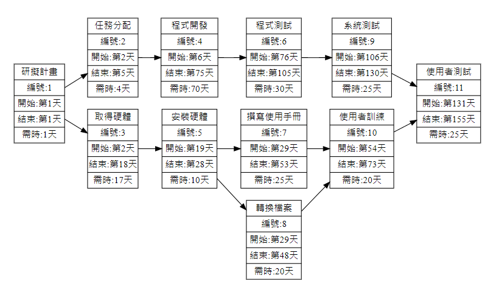
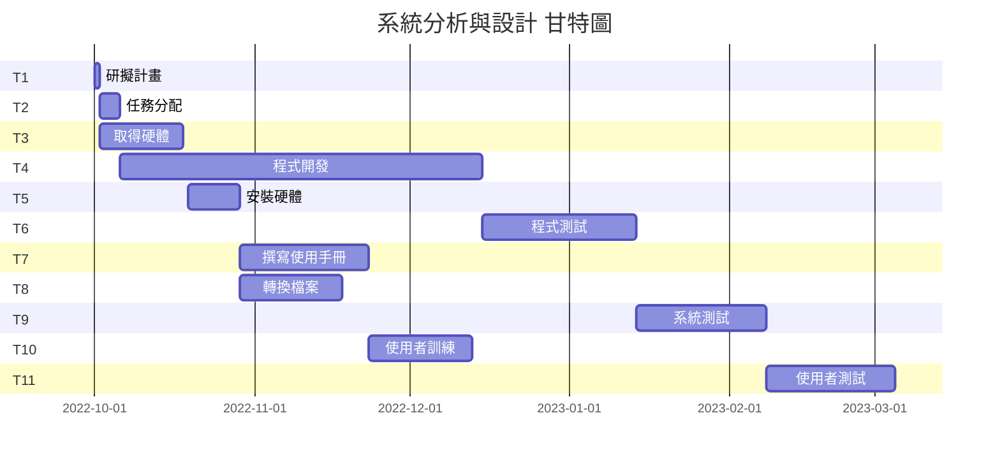

(1)PERT/CPM 圖

---

(2)甘特圖

```mermaid
gantt
    title 系統分析與設計 甘特圖

    Section T1
    研擬計畫      :a1, 2022-10-01, 1d
    Section T2
    任務分配      :after a1  , 4d
    Section T3
    取得硬體      :after a1  , 16d
    Section T4
    程式開發      :a4  ,2022-10-06, 70d
    Section T5
    安裝硬體      :a5  ,2022-10-19, 10d
    Section T6
    程式測試      :after a4  , 30d
    Section T7
    撰寫使用手冊      :after a5  , 25d
    Section T8
    轉換檔案      :after a5  , 20d
    Section T9
    系統測試      :a9  ,2023-01-14, 25d
    Section T10
    使用者訓練      :after a7  ,2022-11-23, 20d
    Section T11
    使用者測試      :after a9  , 25d
```
---

(3)關鍵路徑

1 -> 2 -> 4 -> 6 -> 9 -> 11

